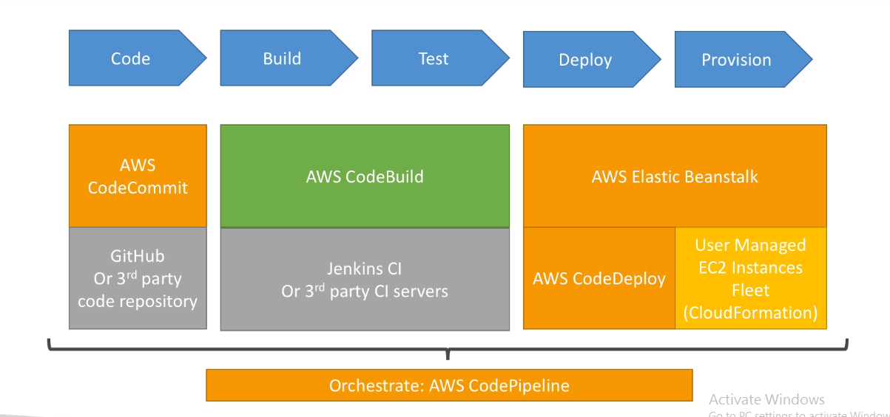
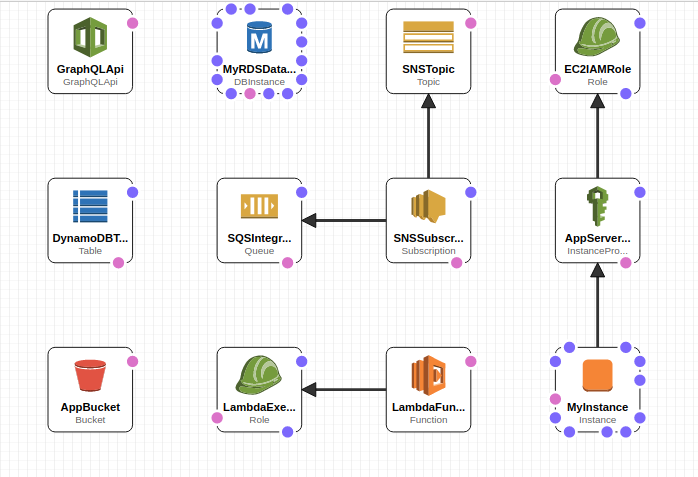

In this cloudformation stack deployment there are two steps to follow.

1. Setup an AWS four(4) stage CI/CD pipeline with manual approval in each steps.
2.  Writing a template for an architecture using AWS services such as IAM Role, S3, SNS, EQS, AWS GraphSql API, Lambda Function, RDS and DynamoDB Database.
  
First step we have to build a CI/CD pipeline using cloudformation template. For this I have used AWS services such as AWS pipeline, codecommit, codebuild, codedeply. From below diagram we can understand how these each services are integrated with each other.

For this we have to follow few steps to build our pipeline using cloudformation template. I have uploaded the template file (pipeline-template.yml)  to git for pipeline creation. 

First login in to your AWS account and go to cloudformation service.
There you can see create stack button and once you click it you will be redirected to template file upload window.
Select the option “Template is Ready” and upload the pipeline-template.yml file to there.
When you click next in the next page it is asking a name for the stack and go ahead until stack creation page.
As below screen shot you will be able to see stack creation with each AWS resources defined in the cloudformation template

Once it is success in Cloudformation stack when you go to template/view in designer you can see the built architecture visually and related dependecies as per below screen shot. 

	

And if you go to AWS codepipeline service you will see the each steps in CI/CD pipeline which we defines in our cloudformation template as below

	
	Note : You will see an error message as failed in AWS code commit service since we have not commited anything yet to codecommit repository.

Next go to AWS CodeCommit repository in AWS services. As per below screen shot you will see created repository during our stack creation.

 
	
	Note: Inside this repository you will not see any file we have to upload file to this in next step.

There you have to commit this buildspec.yml and template.yml file to repository. I have already provided those two files in my git repository. 

	Note:For this you can clone the repository and use git command to upload these two files.

This buildspec.yml file contains collection of build commands and related settings, in YAML format, that CodeBuild uses to run a build.

This template.yml file contains proposed architecture to build for this test as a cloudformation template in the second task.

Once you committed these two files in to codecommit our created codepipeline automatically trigger and start to deploy the architecture requested. In the code pipeline step you will see the progress in each step.

	Note: in each steps since there is manual approval process you have to approve in order to deployment works. Normally in company environment few persons is responsible for this task and that person decide  whether  the deployment is ok or not after checking changes.

If the deployment is success you will see Succeed in each steps as per below screen shot. Else it will be rolled back and you can see the error caused  in cloudformation events. If there should be some changes to fix this issue you have to update the template and just commit in to repository and it will trigger automatically and start deployment again in the pipeline.

 

If the deployment is succeed you will see the new deployment stack created({yourstackname}-deployment) in cloudformation stack. And there template/View in Designer you can see the built architecture in second task.

Here we have created CI/CD pipeline and AWS architecture with few services using cloudformation templates and deployed on AWS cloud enviroment. 

# cicd
# cicd
